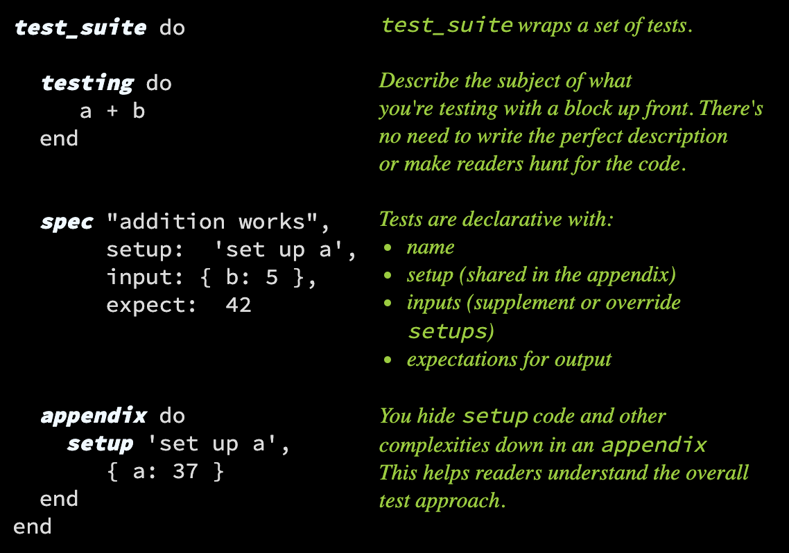

# Thoreau  

A more thoughtful test framework



## Installation

Add `gem 'thoreau'` to your application's Gemfile, or `gem install thoreau`. Neither Rails nor another test framework is required.

## Usage

Create a Ruby file. Here's an `example.rb`:

```ruby
require 'thoreau'
include Thoreau::DSL

suite "example suite" do
    
    testing do
        1 + 1
    end

    spec output: 2
    spec output: 3

end
```
Then, in your terminal:
```shell
$ bundle exec ruby example.rb 
INFO:   § example suite §
INFO:   ✓ spec:   (no args)
ERROR: ❓ spec:   (no args), Expected '3', but got '2'
INFO:  🛑  1 problem(s) detected.  [1 of 2 OK.]
```

## Why

### The Problem

When the first "xUnit" tool was invented in the last century, it was a huge step forward for developers. But besides a mild perspective
change brought with BDD, there has not been much evolution. The current testing frameworks are written by
developers and have a sequential, programmatic approach, even though it is sometimes obscured a bit by the words "spec"
and "be". The advancement of nested specs brought with it a tangle of setup blocks, hierarchies, and unclear intent.

From our tools, our mental models is that tests are a series of steps. Yet we have learned from other programming paradigms, like
declarative and functional programming, that focusing on intent can be more concise than the steps.

As an expert in testing, I've written thousands of tests, used code coverage and branch/logic coverage tools to improve
my tests, and written tests in JUnit, TestUnit, Jest, Jasmine, Jest, Cucumber, Guage, Selenium, Capybara, and many more.
I'm a huge proponent of testing and see it's value on all my projects, but it has only been a few times where I succeeded in creating a clear and maintainable suite of tests.

There has been some out-of-the-box thinking. Cucumber/Gherkin and Gauge are great in how they provide a way to write natural language tests. This is laudable goal,
but end up separating each test into multiple files (at least two). In a magical world where product managers write your
cucumber files, that'd be great, but as a developer writing tests, this is a step backwards in maintainability. From my
experience, they become long narratives or streams of consciousness, which leave the reader begging for some more
structure, and nobody wants to maintain them.

Thoreau attempts to start over and present a new paradigm, based on not a programmer, but a testing perspective.

### Structure

* Thoreau requires the **subject** of the test to be very clear. It's written in the first block of the suite and always
  required. You can do this with other frameworks, but is optional and inconsistent. Unlike other frameworks, the
  subject _cannot_ overridden, in some nested fashion, although it can (and is) parameterized.

* Organize tests into suites with common **setups**.

Yes, `setup` and `before_each` blocks do this, but can easily lead to questions:

- which setups are running for a particular test?
- where are they?

In Thoreau, setups are always written in the appendix of the test suite. For any given test, the set-up blocks that are
run are explicitly listed by name.

### New Terminology?

* Name your test based on the type of test, eg. happy sad spec edge edges boundary corner gigo
* Focus on specific tests while you develop. Like the `:focus` in some frameworks, in Thoreau, just add an exclamation
  mark, eg. `suite` to `suite!` or `spec` to `spec!`

### Less of an Ecosystem, and just a tool

Thoreau uses a dead-simple assertion language. It doesn't have one. Do we really need `.to.eql` and `.to_be.greater_than`.
  Your code under test must return a value, and you write a function that evaluates to true or false.

### Production Ready?

This project is a place to discover and try out new techniques. It's a "proof of concept". Although I'll do what I can
to make it solid, right now it's flexible so the ideas can be evaluated easily. The DSL can certainly evolve, and in
fact, that's really the point.

## Development

After checking out the repo, run `bin/setup` to install dependencies. Then, run `rake spec` to run the tests. You can
also run `bin/console` for an interactive prompt that will allow you to experiment.

To install this gem onto your local machine, run `bundle exec rake install`. To release a new version, update the
version number in `version.rb`, and then run `bundle exec rake release`, which will create a git tag for the version,
push git commits and tags, and push the `.gem` file to [rubygems.org](https://rubygems.org).

### Terminology

(Test) Case ∈ (Test) Family ∈ (Test) Clan ∈ (Test) Suite

* a **clan** of tests all have the "action", or code-under-test
* a **family** of tests all have the same setups and expections, but have different inputs. Commonly known as an *equivalence class*.
* a **case** is a single combination of setups, inputs and executions that either is detects or does not detect a problem.

Note: we avoid using the words pass, bug, error. "

## Contributing

Bug reports and pull requests are welcome on GitHub at https://github.com/ndp/thoreau. This project is intended to be a
safe, welcoming space for collaboration, and contributors are expected to adhere to
the [Contributor Covenant](http://contributor-covenant.org) code of conduct.

## Code of Conduct

Everyone interacting in the Thoreau project’s codebases, issue trackers, chat rooms and mailing lists is expected to
follow the [code of conduct](https://github.com/ndp/thoreau/blob/master/CODE_OF_CONDUCT.md).


## le archive

> Testing shows the presence, not the absence of bugs. -- Edsger W. Dijkstra
